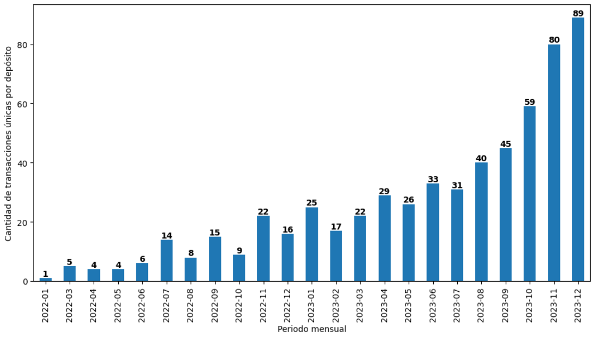
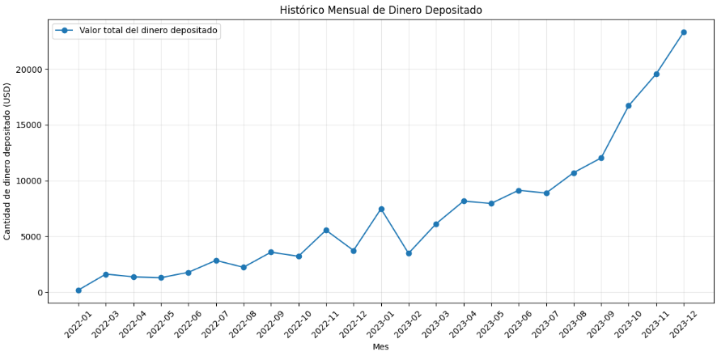
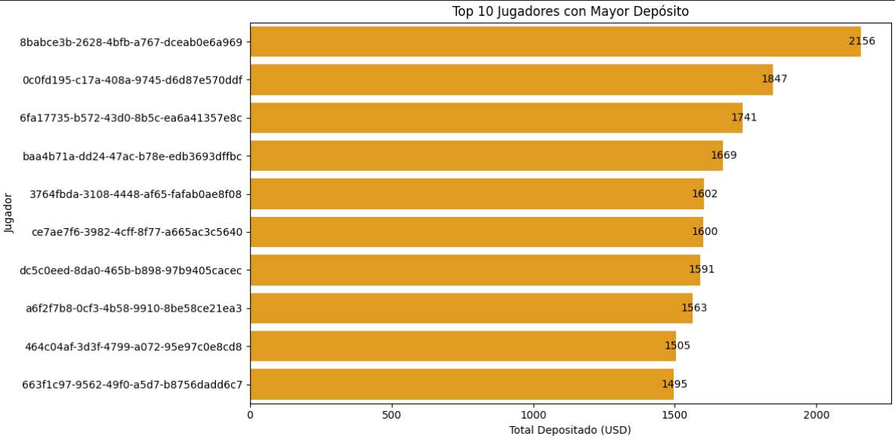
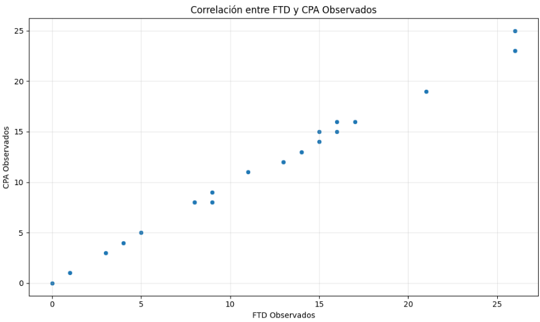

# Análisis de Datos en iGaming: insights visuales para la toma de decisiones estratégicas según patrones de depósito en usuarios de servicios de entretenimiento y apuestas.

## Resumen

Este proyecto tuvo como propósito realizar un análisis de datos integral de los usuarios y sus depósitos en servicios de entretenimiento y apuesto del sector iGaming, buscando identificar patrones de comportamiento, detectar las diferencias entre predicciones internas del negocio y datos observados, y desarrollar un tablero visual BI para facilitar la interpretación y toma de decisiones basadas en datos. El proceso analítico fue realizado sobre datos en crudo suministrados por una empresa ecuatoriana de juegos de casino y apuestas en línea. Este estudio tuvo como propósito principal contribuir con información de valor para la creación de estrategias de adquisición y retención de jugadores. 

Aunque los datos no son representativos debido al tamaño reducido de la base de datos general, su calidad en términos de características o variables relacionadas con la dinámica de los depósitos y los costos asociados a los usuarios y unidades de publicidad, es muy bueno. No obstante, aunque puede realizarle un análisis general de los datos, no pueden modelarse estadísticamente para obtener información más confiable por las limitaciones existentes. 

El análisis permitió evidenciar que en el año 2023 se redujeron las diferencias entre el pronóstico de los indicadores FTD, CPA y los resultados, adicionalmente, aumentaron los depósitos gracias a la mayor estabilidad y confianza en los servicios. En general, todos los usuarios pueden dividirse en dos grupos muy distintos, los “rollers” y los “casuales”, destacando la necesidad de estrategias específicas para optimizar costos y beneficios según el perfil de juego de cada uno. En este mismo sentido, aunque el costo de adquisición por jugador suele ser en promedio moderado-bajo para una empresa emergente en el sector de apuestas y juegos de azar, algunos periodos mensuales presentaron costos elevados por estrategias de marketing poco efectivas, sobre todo en el año 2022 cuando la compañía inició operaciones, lo que requiere un análisis más a fondo para identificar los factores de riesgo asociados al proceso de atracción de nuevos usuarios a los servicios iGaming/iGambling.

## Entendimiento de la problemática del negocio

El objetivo del negocio es discernir sobre las características propias del usuario activo en los juegos de apuestas y el usuario pasivo que requieren de estímulos adicionales, con base en sus patrones de depósitos en el tiempo, y cuál es el impacto de las unidades de publicidad y atracción de clientes (traffickers) sobre el número de jugadores activos. En este sentido, se pone a disposición del analista, registros de información de los jugadores, depósitos, traffickers e indicadores internos de comportamientos esperados que permita estudiar la muestra poblacional de usuarios que realizaron su primer depósito (First Time Deposited - FTD) y aquellos cuyo costo de atracción (Cost Per Acquisition - CPA) ya se ha amortizado por haber realizado depositos totales por un valor superior a $ 100 USD. 

## Entendimiento de los datos

La base de datos esta compuesta de cuatro tablas que contienen segmentadamente información de los jugadores como ID, nombre, país y fecha de registro. Los depósitos de los jugadores, incluyendo el monto del depósito y la fecha. Los datos de adquisición de jugadores, incluyendo el costo de adquisición por jugador, el nombre del trafficker, y la fecha de registro. Y los registros mensuales de la cantidad de FTD y CPA que ha pronosticado la empresa. La segmentación tabular esta dada por:
- 300 registros detallados de usuarios (jugadores únicos).
- 600 registros detallados de transacciones en depósito.
- 300 registros detallados de unidades de atracción de clientes (traffickers) y sus costos asociados.
- 24 registros de las medidas FTD y CPA pronosticadas para el año 2022 y 2023.

Los gráficos a continuación muestran la distribución de la cantidad de depósitos por periodo mensual, y la evolución del valor del depósito en cada periodo mensual del año 2022 y 2023.

**Figura 1. Distribución de la cantidad de depósitos registrados**

    

Se observa un crecimiento constante en la cantidad de depósitos mes a mes desde enero de 2022 hasta diciembre de 2023. Esto sugiere que la empresa ha estado adquiriendo más clientes y/o aumentando la confianza de los jugadores para invertir en las apuestas en línea, con el tiempo. Durante los primeros meses de 2022, el número de depósitos es relativamente bajo (entre 1 y 6 depósitos por mes). Esto es esperable ya que el negocio se encontraba en su fase de crecimiento inicial.

####

**Figura 2. Evolución del valor total del depósito mensual**

    

Los depositos siguen un patrón de crecimiento en el tiempo, aunque no es sistemáticamente consecutivo periodo a periodo, el crecimiento se da en el corto tiempo. Los últimos 4 meses analizados es donde mayor crecimiento en el valor de los depósitovs ha experimentado la empresa. Así mismo, durante el año 2022 el crecimiento fue significativamente menor al que experimentó el año 2023 en los depósitos.

####

***NOTA:*** Como parte del modelado dimensional de los datos, se requirió eliminar columnas innecesarias, verificar valores nulos y registros duplicados, gestionar valores atípicos y realizar un formateo de algunas variables al tipo de dato correcto.

## Resultados cláves del análisis

Es importante analizar como se distribuyen las discrepancias halladas entre los valores de FTD y CPA esperado, con los observados. Para entender mejor cómo ocurre este comportamiento de las métricas se utilizó un gráfico de barras apiladas para entender el comportamiento de las discrepancias en unidades a lo largo de todos los periodos. A continuación, se muestra el gráfico en la Figura 3.

**Figura 3. Distribución de las discrepancias entre valores esperados de FTD y CPA, y los observados**

    

Todos los valores observados fueron menos de lo que se esperaba. Esto ocurre tanto para el FTD como el CPA, siendo la discrepancia en unidades de FTD significativamente mayor que las de CPA en la mayoría de los periodos. Las menores discrepancias por unidades ocurrieron en el periodo 2023-11, 2023-05 y 2023-09. Las mayores discrepancias por unidades ocurrieron en el periodo 2022-06, 2022-12, 2022-04, 2022-05 y 2023-04. La tendencia de las discrepancias es a ser menor con el paso del tiempo.

Por otra parte, fue fundamental identificar a los mejores clientes (jugadores) para perfilar sus comportamientos de depósitos y proponer estrategias de fidelización basadas en estos casos exitosos. Por esta razón, se analizó el top 10 de jugadores que han realizado los mayores depósitos y se evaluó qué tan significativa es la diferencia de inversión respecto a los demás jugadores. Para esto, se utilizó un gráfico de barras horizontal con el fin de visualizar el ID del jugador vs el total depositado a lo largo del histórico de datos. La Figura 4, muestra el top de 10 de jugadores con mayores depósitos totales realizados.

**Figura 4. Top 10 de jugadores con mayores depósitos totales**

    

El mayor valor de depósitos realizados asciende a una cifra de $ 2,156 USD. La diferencia entre el jugador con más dinero invertido y el segundo es de aproximadamente $ 309 USD. El top 10 de los jugadores con más depósitos, hechos han fondeado los servicios gambling con más de $ 1,400 USD cada uno. Todos estos hechos revelaron que, de manera generalizada, existen dos perfiles de jugadores diferentes y por consiguiente, es posible desarrollar estrategias para mejorar la atracción y retención de cada uno según los objetivos empresariales.

En cuanto a las asociaciones univariantes entre las características de los datos (variables), se encontró que la cantidad de jugadores con FTD confirmado puede estar estrechamente correlacionada con la cantidad de jugadores que cumplen la condición CPA activa (valor total de depósitos superior a $100 USD). Debido a que sus valores se mueven estrechamente cerca a medida que crece o decrecen periódicamente. Por tanto, se precdió a crear un gráfico de puntos para visualizar dicha relación, tal como se muestra en la Figura 5.

**Figura 5. Correlación entre métricas FTD y CPA**

    

Los puntos parecen alinearse a lo largo de una tendencia lineal, lo que indica que existe una relación proporcional consistente entre los FTD observados y los CPA observados. Por ejemplo, un porcentaje fijo de los FTD podría estar convirtiéndose en CPA (jugadores de alto valor). Esto es importante de conocer para futuros proyectos de modelación analítica que busque realizar astimaciones confiables, ya que se concluye que estas dos "medidas" pueden ser explicadas a través de una regresión lineal.

## Conclusión

- Se encontró que el comportamiento general de las discrepancias fue levemente decreciente de un periodo mensual a otro. El año 2023 mantuvo menos discrepancias que el año 2022 a lo largo de todos los meses. Se intuye, en un panorama de contexto aislado, que esto puede ser el resultado de un incremento en la estabilidad de los servicios gambling de la empresa en el mercado que bien puede ser generada mayoritariamente por un aumento de confianza de los jugadores.
-  El valor de los depósitos experimentó un crecimiento significativo cuando se contrasta individualmente cada mes con periodos anteriores. Se concluye que el año 2022 fue un año de estabilización donde ocurrieron pocos depósitos por parte de los jugadores y en el año 2023 se aprovechó el posicionamiento de los servicios gambling de la empresa en el mercado para conseguir que los jugadores invirtiesen más dinero en ello.
-  El costo de adquisición de jugadores es bajo en general (menor a 500 USD para empresas pequeñas). Aún así existen algunos periodos donde el costo fue extremadamente alto debido a que la efectividad de las estrategias de marketing no fueron las esperadas. Es importante, ir un poco más allá de los datos proporcionados en este proyecto y encontrar el origen de que esto ocurriese para aprender de ello. NOTA: Se realiza el supuesto de que para una empresa pequeña de desarrollo y oferta de juegos de apuesta, el costo por cliente es bajo cuando la distribución del costo total no supera los 500 USD.
-  Se identifican dos grupos de jugadores: 1) los considerados “rollers” que invierten mucho dinero en las apuestas y 2) los “casuales” cuya inversión no es tan significativa. Sin embargo, la media de los fondos totales por jugador sugiere que la captación de dinero es interesante. Se recomienda diseñar estrategias de promoción y retención de los juegos según el perfil del usuario. Esto permitirá ser más eficiente en el costo/beneficio de los resultados operativos.
- Se encontró que la métrica FTD y CPA están muy correlacionadas, de manera directa y proporcional, es decir que cuando una incrementa la otra también lo hace. Se concluye entonces que dirigir esfuerzos a conseguir que todos los jugadores registrados hagan su primer depósito probablemente resultará en un aumento en las contribuciones mayores a 100 USD. Se recomienda investigar más a fondo los factores que influyen en el FTD de los jugadores para implementar estrategias funcionales.
